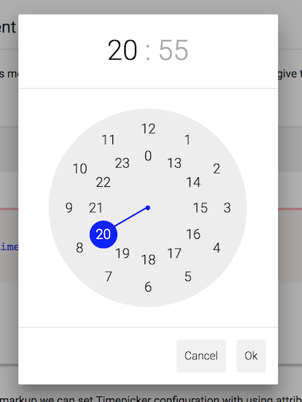

# Casni14 - 24h Clock EDIT
Disclaimer! This is a fork from https://github.com/owsolutions/amazing-time-picker, do not expect that every setting work as described in the original online demo (https://owsolutions.github.io/amazing-time-picker/)
I haven't tested all preferences thoroughly, but it works (as far as i can see) with most of the settings/parameters.
This fork has overwritten the original am/pm clock, therefore all settings/parameters including am or pm will not have any effect (or maybe break 😅) 

### What this fork provides
  * A 24 hour version of Amazing Time picker

### To use/install this: 
  1. download from git
  2. forget npm
  3. copy the atp-library folder into your project 
  4. follow the install guide below and remember to change the import path to your copied folder in AppModule as well as in the components using the AmazingTimePickerService




# Amazing Time Picker (Clock)  [](https://opensource.org/licenses/MIT)

A visual time picker for angular 2+ projects. You can use this timepicker with Angular 2, 4, 5 and Angular Material. **This project doesn't require angular material or any other dependencies**

## Install
You need to install this repository as dependency and import it to your `app.module.ts` in `imports` section.

```
npm install amazing-time-picker --save
```

then, open your `app.module.ts` or other module that you want to use timepicker among, and import and add it to the `imports` section:

```
import { BrowserModule } from '@angular/platform-browser';
import { NgModule } from '@angular/core';
import { AmazingTimePickerModule } from 'amazing-time-picker'; // this line you need
import { AppComponent } from './app.component';

@NgModule({
  declarations: [
    AppComponent
  ],
  imports: [
    BrowserModule,
    AmazingTimePickerModule // this line you need
  ],
  providers: [],
  bootstrap: [AppComponent]
})
export class AppModule { }
```

This helps your angular project to build and compile it and let you use it.

## Using in component markup
After you have installed this module, you can use it within your html templates and give the directive to the any <input> tag. When user closes the dialog, it's gonna update the input value and will listen to input click event to open the dialog.

```html
<input atp-time-picker value="19:00"/>
```

## Opening component programmatically
You can also open a timepicker dialog programmatically. In order to open that, you need to import the service in your component:

```
import { AmazingTimePickerService } from 'amazing-time-picker';
```

Then add it inside your `app.component.ts` or any other component that you want to use timepicker inside of that.

```
import { Component } from '@angular/core';
import { AmazingTimePickerService } from 'amazing-time-picker'; // this line you need

@Component({
  selector: 'app-root',
  templateUrl: './app.component.html',
  styleUrls: ['./app.component.scss']
})
export class AppComponent {
  
  constructor( private atp: AmazingTimePickerService, // this line you need
             ) { }

  open() {
    const amazingTimePicker = this.atp.open();
    amazingTimePicker.afterClose().subscribe(time => {
      console.log(time);
    });
  }
}
```


Online demo


https://owsolutions.github.io/amazing-time-picker/
